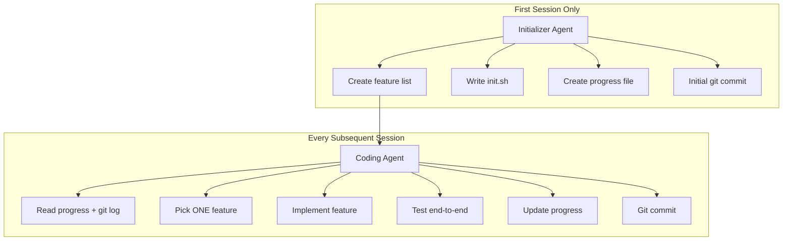
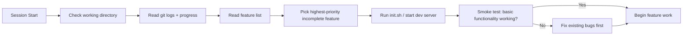
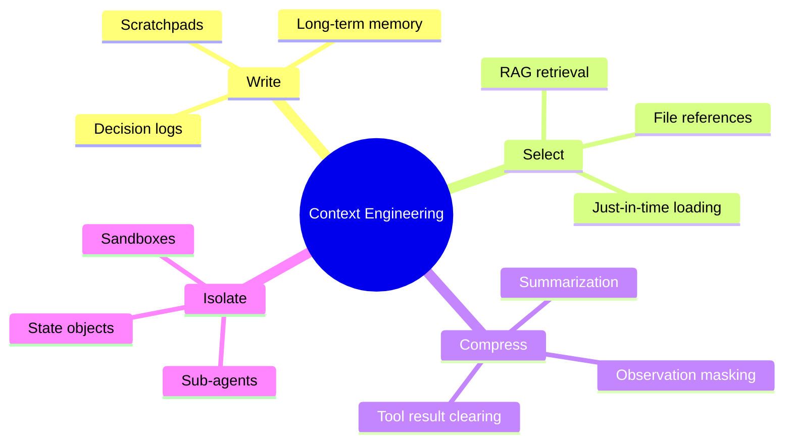
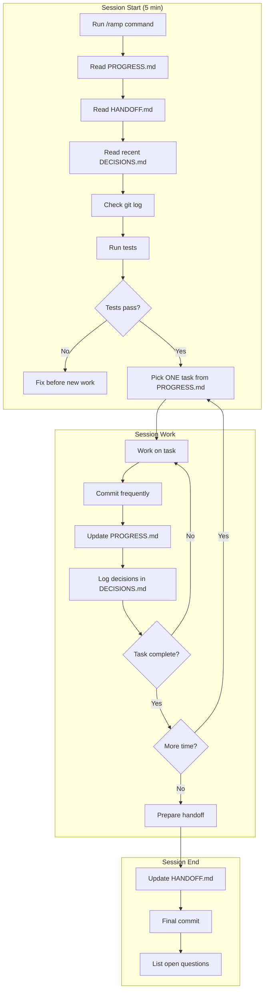

# Long-Running Agent Research & Best Practices

> A comprehensive guide to building infrastructure for AI agents that work effectively across multiple context windows.

This document synthesizes research from Anthropic, LangChain, JetBrains, and practical experience building production agents.

---

## Table of Contents

1. [The Core Problem](#the-core-problem)
2. [Research Sources](#research-sources)
3. [Key Concepts](#key-concepts)
4. [Failure Modes & Solutions](#failure-modes--solutions)
5. [Context Engineering Strategies](#context-engineering-strategies)
6. [The Harness Pattern](#the-harness-pattern)
7. [Implementation Guide](#implementation-guide)
8. [Appendix: Research Excerpts](#appendix-research-excerpts)

---

## The Core Problem

AI agents face a fundamental challenge: **they must work in discrete sessions, and each new session begins with no memory of what came before.**

> "Imagine a software project staffed by engineers working in shifts, where each new engineer arrives with no memory of what happened on the previous shift."
> — [Anthropic, "Effective harnesses for long-running agents"](https://www.anthropic.com/engineering/effective-harnesses-for-long-running-agents)

### Why This Matters

- **Context windows are limited** — Even 200K tokens gets exhausted on complex projects
- **Context rot is real** — Model accuracy degrades as context grows ([research](https://research.trychroma.com/context-rot))
- **Compaction alone isn't sufficient** — Summarization loses critical details
- **Complex projects can't be one-shot** — They require multiple sessions

### The Solution

A **harness** — infrastructure that:
1. Sets up the initial environment with clear artifacts
2. Enables incremental progress across sessions
3. Leaves clean state for the next session

---

## Research Sources

| Source | Date | URL | Key Contribution |
|--------|------|-----|------------------|
| Anthropic | Nov 2025 | [Effective harnesses for long-running agents](https://www.anthropic.com/engineering/effective-harnesses-for-long-running-agents) | Two-agent pattern, feature lists, incremental progress |
| Anthropic | Sep 2025 | [Effective context engineering for AI agents](https://www.anthropic.com/engineering/effective-context-engineering-for-ai-agents) | Context as finite resource, compaction, scratchpads, sub-agents |
| LangChain | Jul 2025 | [Context Engineering for Agents](https://blog.langchain.com/context-engineering-for-agents/) | Write/select/compress/isolate framework |
| JetBrains | Dec 2025 | [Smarter Context Management](https://blog.jetbrains.com/research/2025/12/efficient-context-management/) | Observation masking vs. summarization, hybrid approaches |

---

## Key Concepts

### 1. Context as a Finite Resource

> "Context must be treated as a finite resource with diminishing marginal returns. Like humans, who have limited working memory capacity, LLMs have an 'attention budget' that they draw on when parsing large volumes of context."
> — [Anthropic, Context Engineering](https://www.anthropic.com/engineering/effective-context-engineering-for-ai-agents)

**Implication:** Don't just add information — curate it. Every token should earn its place.

### 2. The Two-Agent Pattern

Anthropic recommends splitting long-running work into two specialized roles:



### 3. Incremental Progress

> "We asked the model to work on only one feature at a time. This incremental approach turned out to be critical to addressing the agent's tendency to do too much at once."
> — [Anthropic, Effective harnesses](https://www.anthropic.com/engineering/effective-harnesses-for-long-running-agents)

**Why it works:**
- Prevents context exhaustion mid-feature
- Leaves code in a mergeable state
- Clear handoff points between sessions

### 4. Structured Note-Taking

> "Like Claude Code creating a to-do list, or your custom agent maintaining a NOTES.md file, this simple pattern allows the agent to track progress across complex tasks."
> — [Anthropic, Context Engineering](https://www.anthropic.com/engineering/effective-context-engineering-for-ai-agents)

**Key artifacts:**
- **Feature list** — What needs to be built (with pass/fail status)
- **Progress file** — What's been done, what's next
- **Decision log** — Why things were done (prevents re-litigation)
- **Handoff file** — Current session state for next session

---

## Failure Modes & Solutions

Based on Anthropic's research, here are common failure modes and their solutions:

| Failure Mode | Description | Solution |
|--------------|-------------|----------|
| **One-shotting** | Agent tries to build everything at once, runs out of context mid-implementation | Feature list with incremental progress (one feature at a time) |
| **Premature completion** | Agent sees progress, declares job done before all features work | Feature list with explicit pass/fail tracking |
| **Context pollution** | Old, irrelevant context degrades performance | Observation masking, compaction, structured handoffs |
| **Lost reasoning** | Agent forgets why decisions were made | Decision log with reasoning |
| **Broken handoffs** | Next session can't understand state | Progress file, git commits, explicit handoff notes |
| **Untested features** | Features marked done without end-to-end verification | Browser automation, explicit testing requirements |

### The Session Startup Sequence

Anthropic recommends this pattern for every new session:



---

## Context Engineering Strategies

LangChain's framework organizes context management into four strategies:



### Write — Save context outside the window

**Scratchpads:** Save information during a session for later use
- HANDOFF.md — Current session state
- PROGRESS.md — What's done, what's next
- DECISIONS.md — Why decisions were made

**Long-term memory:** Persist across sessions
- FEATURES.json — Feature list with pass/fail
- CLAUDE.md — Project-specific instructions

### Select — Pull context into the window

**Just-in-time retrieval:** Load data only when needed
> "Rather than pre-processing all relevant data up front, agents maintain lightweight identifiers (file paths, stored queries, web links) and use these references to dynamically load data into context at runtime."
> — [Anthropic, Context Engineering](https://www.anthropic.com/engineering/effective-context-engineering-for-ai-agents)

**Rules files:** Always-loaded context
- Claude Code uses CLAUDE.md
- Cursor uses .cursorrules
- Windsurf uses directory rules

### Compress — Retain only essential tokens

**JetBrains research** compared two approaches:

| Approach | How it works | Cost reduction | Performance impact |
|----------|--------------|----------------|-------------------|
| **Observation masking** | Hide old tool outputs with placeholders | ~52% cheaper | Often better (!) |
| **LLM summarization** | Summarize old interactions | ~50% cheaper | Sometimes causes trajectory elongation |

**Key finding:** Simple observation masking often outperforms complex summarization:
> "The simple approach of observation masking wasn't just cheaper; it often matched or even slightly beat LLM summarization in solving benchmark tasks."
> — [JetBrains Research](https://blog.jetbrains.com/research/2025/12/efficient-context-management/)

### Isolate — Split context across boundaries

**Sub-agents:** Each agent gets its own context window
> "Many agents with isolated contexts outperformed single-agent, largely because each subagent context window can be allocated to a more narrow sub-task."
> — [Anthropic, Multi-agent research system](https://www.anthropic.com/engineering/multi-agent-research-system)

**State objects:** Store context in state, expose selectively to LLM

---

## The Harness Pattern

Based on all research, here's the recommended harness structure:

### Directory Structure

```
your-project/
├── .claude/
│   ├── commands/
│   │   └── ramp.md          # Custom /ramp command for session start
│   ├── session-start.md     # Startup checklist
│   └── settings.local.json  # Tool permissions
│
├── docs/
│   ├── PROGRESS.md          # What's done, what's next
│   ├── DECISIONS.md         # Why decisions were made
│   ├── HANDOFF.md           # Current session state
│   ├── FEATURES.json        # Feature list with pass/fail
│   └── CLAUDE_VOICE.md      # Agent persona (optional)
│
└── CLAUDE.md                # Project-specific instructions
```

### File Purposes

| File | Purpose | When Updated |
|------|---------|--------------|
| `PROGRESS.md` | Track completed and pending tasks | After each task completion |
| `DECISIONS.md` | Log significant decisions with reasoning | When making non-obvious choices |
| `HANDOFF.md` | Capture session state for next session | End of every session |
| `FEATURES.json` | Feature list with pass/fail status | After testing each feature |
| `CLAUDE.md` | Project context, commands, patterns | When project structure changes |
| `/ramp` command | Quick session startup | Rarely (once set up) |

### Session Workflow



---

## Implementation Guide

### Essential Files

#### 1. PROGRESS.md

```markdown
# Progress Log

## Current Status: [PHASE NAME]

## Completed ✅
| Task | Date | Notes |
|------|------|-------|
| Feature A | Dec 1 | Tested, working |

## In Progress
- [ ] Feature B — started, needs API integration

## Next Up
| Task | Priority | Notes |
|------|----------|-------|
| Feature C | P1 | Blocked on design decision |
```

#### 2. DECISIONS.md

```markdown
# Decision Log

## YYYY-MM-DD: [Decision Title]

**Decision:** What was decided

**Alternatives Considered:**
1. Option A — Why not chosen
2. Option B — Why not chosen

**Reasoning:** Why this decision makes sense

**Owner:** Who made this call
```

#### 3. HANDOFF.md

```markdown
# Session Handoff

**Last Updated:** YYYY-MM-DD
**Status:** Brief description

## What Was Done This Session
- Item 1
- Item 2

## Current State
- Git: Clean/dirty
- Tests: Passing/failing
- Build: Working/broken

## What's Next
1. Priority item
2. Secondary item

## Open Questions for Human
1. Question needing human input
```

#### 4. FEATURES.json

```json
[
  {
    "id": "feature-1",
    "category": "core",
    "description": "User can sign up with email",
    "steps": [
      "Navigate to signup page",
      "Enter email and password",
      "Submit form",
      "Verify confirmation email sent"
    ],
    "passes": false,
    "testedOn": null
  }
]
```

#### 5. /ramp command (`.claude/commands/ramp.md`)

```markdown
You are resuming work on [PROJECT NAME].

## Session Start Protocol

1. **Orient** — Read these files:
   - docs/PROGRESS.md (what's done, what's next)
   - docs/HANDOFF.md (current session state)
   - docs/DECISIONS.md (recent decisions)

2. **Verify** — Run:
   - `npm test` — all passing?
   - `npm run dev` — starts without errors?

3. **Plan** — Pick ONE task from PROGRESS.md

4. **Execute** — Work incrementally, commit often

5. **Handoff** — Before ending, update HANDOFF.md
```

---

## Appendix: Research Excerpts

### On Feature Lists (Anthropic)

> "To address the problem of the agent one-shotting an app or prematurely considering the project complete, we prompted the initializer agent to write a comprehensive file of feature requirements expanding on the user's initial prompt. In the claude.ai clone example, this meant over 200 features."

### On Incremental Progress (Anthropic)

> "The key insight here was finding a way for agents to quickly understand the state of work when starting with a fresh context window, which is accomplished with the progress file alongside the git history. Inspiration for these practices came from knowing what effective software engineers do every day."

### On Context Rot (Anthropic)

> "Studies on needle-in-a-haystack-style benchmarking have uncovered the concept of context rot: as the number of tokens in the context window increases, the model's ability to accurately recall information from that context decreases."

### On Simple vs. Complex (JetBrains)

> "Both smart and simple strategies halved costs versus doing nothing, but simplicity often takes the prize for total efficiency and reliability. So, even though summarization sounds smart, in practice, it's extra costly and doesn't reliably outperform the simpler masking approach."

### On Note-Taking (Anthropic)

> "Claude playing Pokémon demonstrates how memory transforms agent capabilities. The agent maintains precise tallies across thousands of game steps. After context resets, the agent reads its own notes and continues multi-hour training sequences. This coherence across summarization steps enables long-horizon strategies that would be impossible when keeping all the information in the LLM's context window alone."

---

## Summary

Building effective long-running agents requires:

1. **Infrastructure** — Feature lists, progress files, decision logs, handoff notes
2. **Discipline** — One feature at a time, commit often, clean handoffs
3. **Simplicity** — Simple observation masking often beats complex summarization
4. **Verification** — Don't mark features done until tested end-to-end

The harness pattern provides this infrastructure. Use `agent-harness init` to bootstrap it for any project.

---

*Document generated based on research from Anthropic, LangChain, JetBrains, and practical experience. December 2024.*
